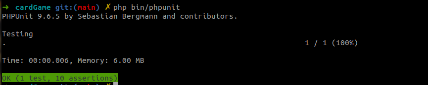
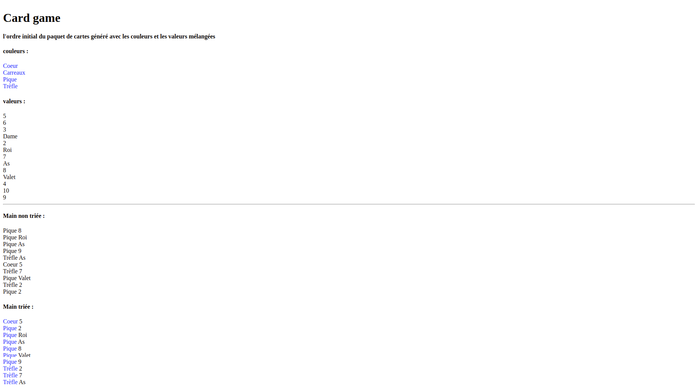

# cardGame

### Lancer l'application :
prérequis : version du php >= 8.1 avec symfony cli d'installé pour faciliter le lancement de l'application et pas besoin de configurer un vhost
```batch
symfony server:start
```
Ouvrir le navigateur et accéder à cette url http://localhost:8000/play/with/card

### Lancer les tests:
```batch
bin/phpunit
```


### Exemple de résultat :

